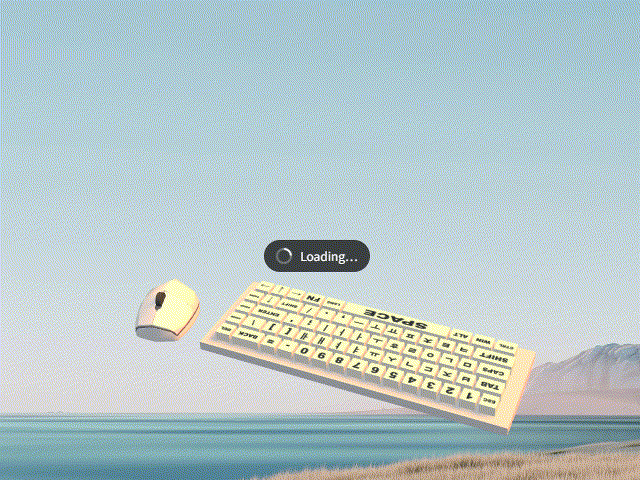
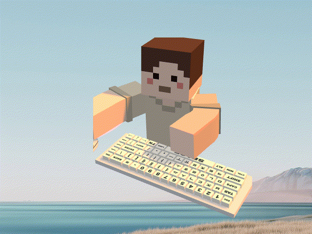
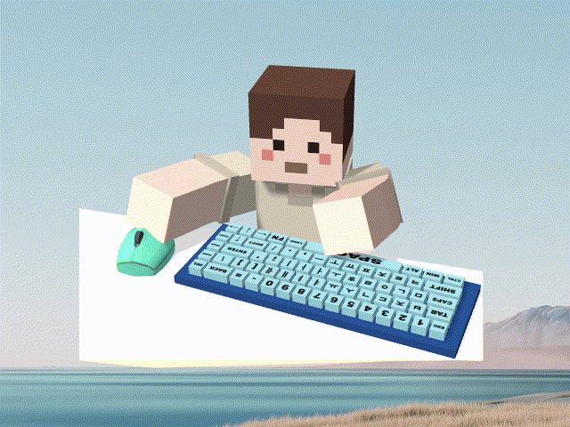
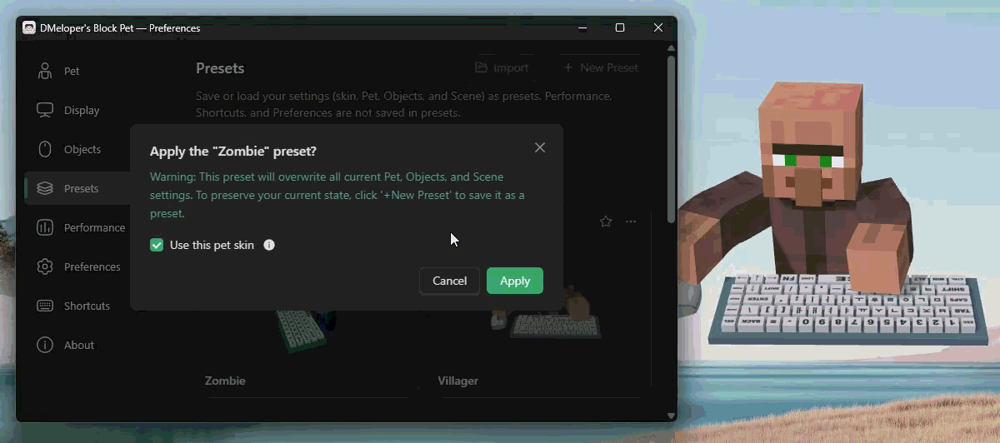

  

# DMeloper's Block Pet

[English](README.md) | 한국어

  
  
  
  

DMeloper's Block Pet은 키보드와 마우스에 반응하는 마인크래프트 스타일의 Windows용 데스크톱 펫입니다.

펫의 스킨을 원하는 대로 변경하거나 사용자 설정을 프리셋으로 저장하고 내보낼 수 있습니다. 펫의 외형, 주변 요소, 화면과 조명을 꾸미고 OBS 방송 화면에 출력할 수도 있습니다.

## 주요 기능

- **키보드 입력과 마우스 움직임·클릭에 반응하는 3D 펫**

  

    
    &nbsp;&nbsp;
    
  

   

- **64×64 또는 기존 64×32 PNG 스킨과 Minecraft Java Edition 닉네임으로 스킨 적용**

  

    
  

   

- **머리 크기, 펫 방향, 양팔의 굽힘·벌림, 눈썹 모양·색상과 손바닥 색상 변경**

  

    
  

   

- **화면 확대·회전·투명도·좌우 반전과 표시 영역의 자동·수동 변경**

  

    
  

   

- **책상의 크기·높이·색상·투명 여부와 키보드·마우스의 위치·크기·색상 변경**

  

    
  

   

- **미리보기, 즐겨찾기, 복제, 순서 변경과 `.petpreset` 가져오기·내보내기를 지원하는 프리셋**

  

    
  

## 다운로드

##### 마이크로소프트 스토어 공식 다운로드 경로 (Windows 10 빌드 19045.3448+ / Windows 11 빌드 22621.2283+, x64)

#### ⚠️ 주의사항

마이크로소프트 스토어에서 설치하면 아래 안내의 설치 차단이나, 백신 격리 검사가 발생하지 않지만, 별도 심사를 거치기 때문에 새 버전이 반영되기까지 **최대 3 영업일이 소요될 수 있습니다.**

그전에 미리 최신 버전을 내려 받고 싶으시거나, 앱 내의 자동 업데이터로 항상 빠르게 최신 버전을 내려 받고 싶으시다면 하단 GitHub Releases에서 프로그램을 설치해 주시기 바랍니다.

> [!NOTE]
> [**이 프로그램은 바이러스가 아닙니다 🛡️ (설치 차단, 백신 검사 안내)**](docs/INSTALLATION_WARNINGS.ko-KR.md)

[GitHub Releases](https://github.com/d-meloper/dmelopers-block-pet/releases)

GitHub에서 직접 설치할 때는 `.exe` 설치파일을 실행하세요. 함께 제공하는 `.sig` 파일은 파일 검증용이므로 일반 설치 시 별도로 내려받지 않아도 됩니다. 공개된 릴리즈 노트에서 변경 사항과 설치파일의 SHA-256을 확인해 주세요. 다운로드 경고와 서명 검증에 관한 내용은 [보안 안내](docs/SECURITY.ko-KR.md)에 정리했습니다.

## 요구 사항

- Windows 10 22H2, 빌드 19045.3448 이상, x64
- Windows 11 22H2, 빌드 22621.2283 이상, x64
- Microsoft Edge WebView2 Runtime 120 이상

- 권장 환경: Windows 11 24H2, 빌드 26100 이상, x64

GitHub 설치 프로그램은 필요한 경우 WebView2를 설치하며, 이 과정에는 인터넷 연결이 필요합니다.

macOS, Linux와 Windows ARM용 배포는 지원하지 않습니다.

## 기본 사용 방법

설치, 스킨 적용, 프리셋과 OBS 사용 방법은 [프로그램 노션 페이지](https://aismash.notion.site/DMeloper-s-Block-Pet-0da2dc0bb4ae82ab8db301718dde497b)에서 확인하세요.

현재 설정은 자동 저장됩니다. 마음에 드는 구성을 보관하려면 `프리셋 > +새 프리셋`을 사용하세요.

## 문제 해결

먼저 다음 항목을 확인해 보세요.

- 펫이 보이지 않으면 트레이 메뉴의 `펫 표시`, 방송 설정의 `내 화면에 펫 표시` 확인
- 펫을 클릭하거나 드래그할 수 없으면 트레이 메뉴에서 `클릭 통과` 해제
- 스킨 적용이 실패하면 PNG 형식과 64×64·64×32 크기, Java Edition 닉네임과 인터넷 연결 확인
- OBS에 표시되지 않으면 앱 실행 상태, 방송용 출력과 연결 주소를 확인한 뒤 브라우저 소스 새로고침
- 문제가 계속되면 트레이 메뉴의 `앱 종료`로 완전히 종료한 뒤 다시 실행
- 오류가 발생하면 `정보 > 문의하기`로 제보하기

설치와 복구는 [지원 안내](docs/SUPPORT.ko-KR.md), 정보 처리와 데이터 보관·삭제는 노션의 [개인정보 처리방침](https://aismash.notion.site/3f12dc0bb4ae809fb5becfc2376d4a5c)과 [데이터 관리 안내](https://aismash.notion.site/0342dc0bb4ae831581878180c15c0059)를 확인하세요.

## 문의 / 버그 제보 / 기여

문의나 버그 제보 전에 아래 문서를 먼저 확인해 주세요.

- [자주 묻는 질문](https://aismash.notion.site/6a62dc0bb4ae8219902f81f8e89cbc28)
- [알려진 버그](https://aismash.notion.site/d5e2dc0bb4ae82a7ac9a01e543e1c84a)

사용 문의, 버그 제보와 기능 제안은 아래 설문지로 보낼 수 있습니다.

[DMeloper's Block Pet 설문지](https://aismash.notion.site/9cff9655595342d78a22c17b61a2084c)

GitHub에서도 [Issues](https://github.com/d-meloper/dmelopers-block-pet/issues)로 문제를 제보할 수 있습니다. 코드·문서·번역을 제안하려면 Pull Request를 열기 전에 [기여 안내](docs/CONTRIBUTING.ko-KR.md)를 확인해 주세요.

버그를 제보할 때는 `정보 > 환경 정보`에서 실행 환경을 복사해 첨부해주시면 원인 파악에 큰 도움이 됩니다.

## 지원

- 버그와 기능 요청: [설문지](https://aismash.notion.site/9cff9655595342d78a22c17b61a2084c), [GitHub Issues](https://github.com/d-meloper/dmelopers-block-pet/issues)
- 코드·문서·번역 기여: [기여 안내](docs/CONTRIBUTING.ko-KR.md)
- 개인정보와 데이터: [개인정보 처리방침](https://aismash.notion.site/3f12dc0bb4ae809fb5becfc2376d4a5c) · [데이터 관리 안내](https://aismash.notion.site/0342dc0bb4ae831581878180c15c0059)
- 보안 제보: [보안 안내](docs/SECURITY.ko-KR.md)의 비공개 제보 절차 이용

## 크레딧

- 프로그램 제작자: [DMeloper](https://litt.ly/dmeloper)
- 일부 원본 코드: [ayangweb/BongoCat v1.1.0](https://github.com/ayangweb/BongoCat/tree/v1.1.0)
- UI 아이콘: [Solar Icons](https://icon-sets.iconify.design/solar/), [Lucide Icons](https://lucide.dev/), [Ant Design Icons](https://github.com/ant-design/ant-design-icons)

각 프로젝트와 자산의 저작권·라이선스는 [제3자 고지](docs/THIRD_PARTY_NOTICES.ko-KR.md)에 정리되어 있습니다.

## 라이선스 및 권리 고지

앱 소스와 DMeloper가 직접 제작한 기본 3D 모델·기본 PNG 스킨·앱 아이콘 및 그 파생 아이콘에는 [MIT 라이선스](LICENSE)가 적용됩니다. 저작권·허가 고지를 유지하면 수정·재배포·상업적 이용이 가능합니다. 원본 코드의 저작권과 제3자 자산·의존성의 라이선스 고지는 각각 유지됩니다. DMeloper's Block Pet은 BongoCat의 일부 코드에서 파생된 독립 프로젝트이며 공식 BongoCat 배포판이 아닙니다.

이 프로그램은 공식 Minecraft 제품이 아니며 Mojang Studios 또는 Microsoft의 승인·제휴·후원을 받지 않았습니다. Minecraft와 관련 상표·이름·저작권은 각 권리자에게 귀속됩니다.
