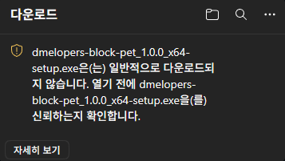
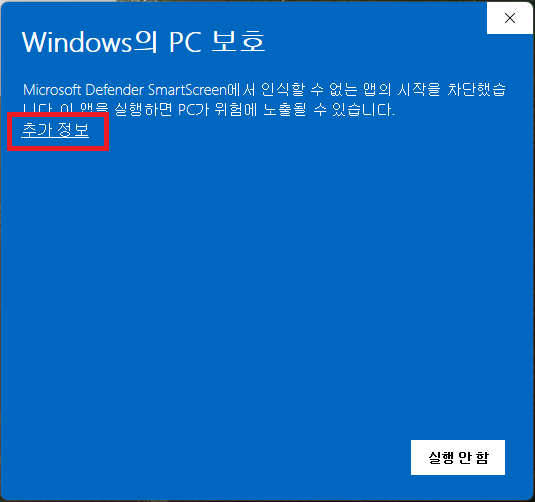
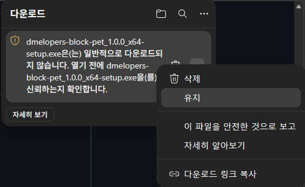
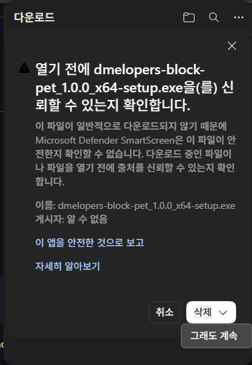
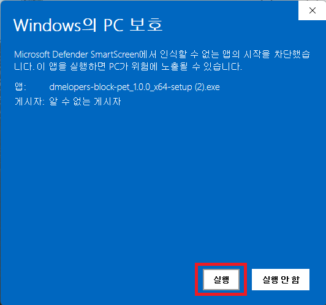

# 설치 경고 안내

한국어 · [English](INSTALLATION_WARNINGS.md)

[다운로드로 돌아가기](../README.ko-KR.md#다운로드)

**이 프로그램은 바이러스가 아닙니다 🛡️ (설치 차단, 백신 검사 안내)**

프로그램 설치를 시도하면 사용 중인 웹 브라우저에 따라 하단의 이미지처럼 설치가 제한되거나 격리 검사가 이루어지는 경우가 있을 수 있습니다.

  
  &nbsp;
  
  &nbsp;
  

## Q1. 왜 이런 경고가 발생하나요?

**A1. 낮은 다운로드 이력** 
새로 출시한 버전인 경우, 많은 다운로드가 이루어지지 않아 검증되지 않은 프로그램으로 판별해 안전을 위해 경고가 표시됩니다.

**A2. 서명되지 않은 프로그램** 
프로그램 개발자가 누구인지 서명이 되어있지 않아서 안전을 위해 경고가 표시됩니다.

## Q2. 왜 프로그램 서명을 하지 않았나요?

**A. 프로그램 서명은 주기적으로 비용을 지출해야 하기 때문에** 무료로 운영하고 배포하는 본 프로그램에 서명을 진행하지 않았습니다. 
하지만 이러한 경고를 줄이기 위해 [**Azure 아티팩트 서명 작업**](https://azure.microsoft.com/ko-kr/products/artifact-signing/)을 검토 중입니다.*(2026년 10월 8일 기준)* 우선 신청할 자격이 되는지 검증하고, 웹 사이트 개설과 심사가 필요해 최소 한 달 정도 시간이 소요될 것으로 예상됩니다. 그 전까지는 경고가 계속해서 나타날 수 있습니다.

아래의 임시 조치 방법이 번거로우시다면 [마이크로소프트 앱스토어 공식 다운로드 경로](https://apps.microsoft.com/detail/9PLKW6NBMKQ7?hl=ko-KR)에서 프로그램을 설치해주시기 바랍니다. (이 경로에서는 경고가 발생하지 않지만, 최신 버전 업데이트 반영이 늦을 수 있습니다.)

## 경고창 임시 조치 방법

### 설치 중 경고가 발생한 경우

1. **[···]** → **[유지]** 를 클릭합니다.

  

2. 삭제 버튼 우측의 **[⌵] → [그래도 계속]** 버튼을 클릭합니다.

  

3. 완료

### 설치 완료 후 실행 전 경고가 발생하는 경우

1. **[ 추가 정보 ]** 버튼을 클릭합니다.

  

2. **[ 실행 ]** 을 클릭합니다.

  

3. 완료

## 백신 임시 조치 방법

격리 검사가 완료되고 나면 **‘파일 처리 방법’** 중 **[한 번만 실행]** 또는 **[파일 해시 예외 처리 후 실행]** 을 선택한 뒤 실행해주시면 됩니다.

  

