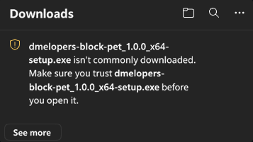
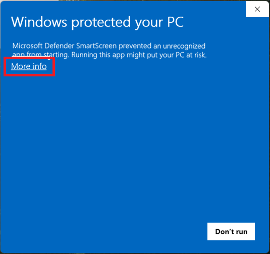
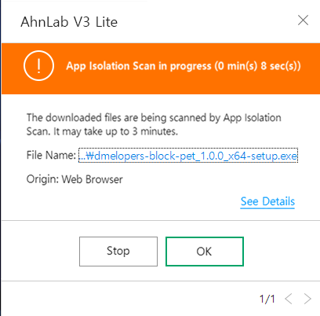
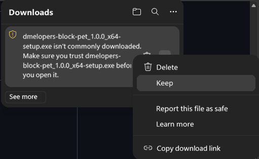
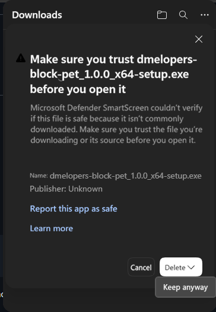
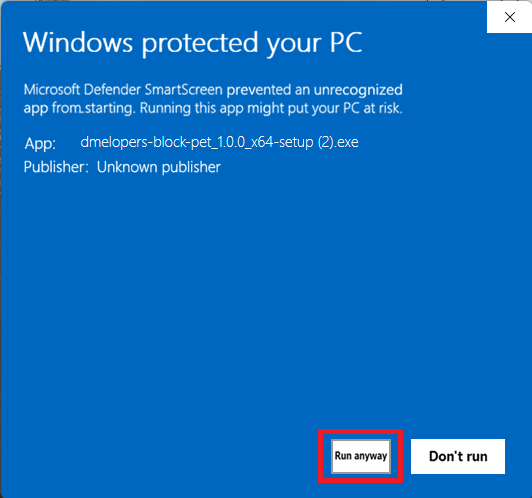
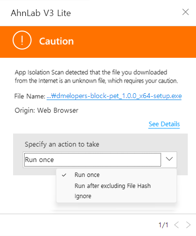

# Installation warnings

[한국어](INSTALLATION_WARNINGS.ko-KR.md) · English

[Back to Download](../README.md#download)

**This program is not a virus 🛡️ · Warning explanations and workarounds**

When you try to install the program, your web browser may restrict the download or a security program may run a quarantine scan, as shown below.

  
  &nbsp;
  
  &nbsp;
  

## Q1. Why do these warnings appear?

**A1. The program has few downloads** 
A newly released version has not been downloaded many times, so it may be treated as an unverified program and trigger a warning as a precaution.

**A2. The program is not code-signed** 
The program does not have a publisher signature identifying its developer, so a warning may appear as a precaution.

## Q2. Why is the program not code-signed?

**A. Code signing involves recurring costs**, so this free program has been distributed without code signing. To reduce these warnings, [**Azure Artifact Signing**](https://azure.microsoft.com/en-us/products/artifact-signing/) is being considered as of October 8, 2026. Eligibility must first be checked, and setting up a website and completing the review process are expected to take at least about a month. Warnings may continue to appear until then.

If you are uncomfortable with the workarounds below, install the program through the [official DMeloper’s Block Pet Microsoft Store page](https://apps.microsoft.com/detail/9PLKW6NBMKQ7?hl=en-US). These warnings do not appear when installing through this route.

## Warning workarounds

### If Microsoft Edge warns during the download

1. Click **[···] → [Keep]**.

  

2. Click **[⌵]** next to **[Delete]**, then **[Keep anyway]**.

  

3. Done.

### If SmartScreen warns when running the installer

1. Click **[More info]**.

  

2. Click **[Run anyway]**.

  

3. Done.

## Antivirus workaround

After the quarantine scan finishes, select **[Run once]** or **[Run after excluding File Hash]** under **[Specify an action to take]**, then run the program.

  

